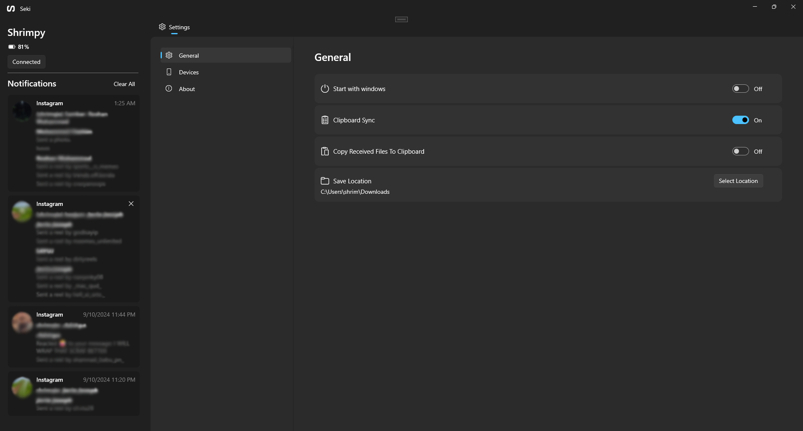

  

# Seki

**Seki** is a custom-built Windows app designed to enhance your workflow by enabling seamless clipboard and notification sharing between your Windows PC and Android device. It's an alternative to existing solutions, tailored for users who want a straightforward and efficient way to keep their devices in sync.
## Features

- **Clipboard Sharing**: Seamlessly share clipboard content between your Android device and Windows PC.
- **Media Control**: Control media playback and volume of your PC from android. 
- **File Sharing**: Share files between your devices easily.
- **Notification**: Allows toasting the notifications from your android in desktop.

## Limitations

- **Clipboard Sharing on Android 13+**:
    - Due to Android's restrictions, clipboard sharing is only possible via the share sheet after Android 13.
## Installation

  <!-- Store Badge -->
  <a style="text-decoration:none" href="https://apps.microsoft.com/detail/9PJV6D1JPG0H?launch=true&mode=full">
    <picture>
      <source media="(prefers-color-scheme: light)" srcset="./readme-images/StoreBadge-dark.png" width="220" />
      
  </picture></a>

## How to Use

1. **Setting Up**:
    - Permissions: Allow the app to post notifications, location access, and restricted access from App Info (after trying to grant the notification access), .
    - Ensure both your Android device and Windows PC are connected to the same network.
    - Launch the app on your Windows PC.
    - Try to add a new device from the device card or device tab(Pull to refresh if it doesn't show any devices).

2. **Clipboard Sharing**:
    - Copy content on the desktop and it will automatically sync with your android (That is if you have enabled it from the settings).
    - To share clipboard from android you will have to manually sent it through the share sheet that shows after you perform a copy action).
3. **File Transfer**:
    - Use the share sheet from android/windows and select the app to share any files between the devices. 

## Screenshots

  

## Roadmap

- Notification Actions.
- Exploring Device Files.
- Screen Casting

## Tech Stack

- **Android**: Kotlin, Jetpack Compose
- **Desktop**: [Seki](https://github.com/shrimqy/Seki) (WinUI 3, C#)
- **Network**: Mdns, Websockets. 
## License

Sekia is licensed under the  GNU GENERAL PUBLIC LICENSE. See [LICENSE](https://github.com/shrimqy/Sekia/blob/master/LICENSE) for more details.
